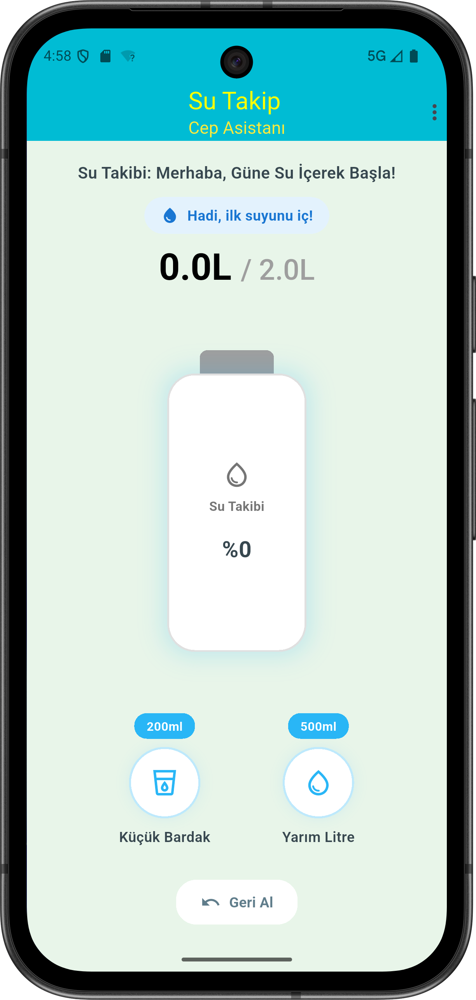
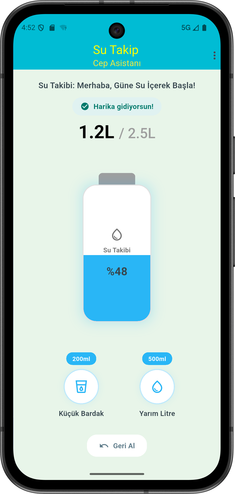
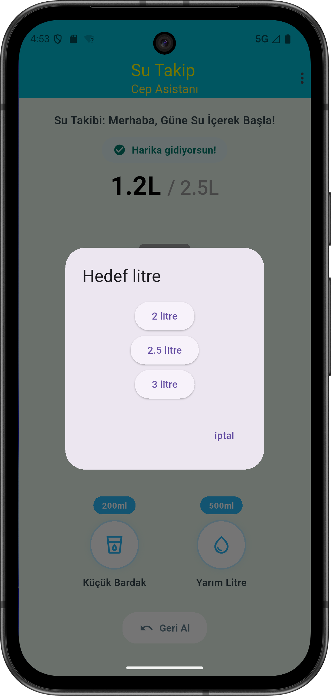

# 💧 Su Takip - Cep Asistanı (Water Tracker App)

Bu proje, kullanıcıların günlük su içme hedeflerini belirlemelerine ve gün içindeki tüketimlerini şık bir arayüzle takip etmelerine olanak tanıyan, modern bir Flutter mobil uygulamasıdır. 

"Clean Code" prensipleri ve ölçeklenebilir bir mimari göz önünde bulundurularak geliştirilmiştir.

## 🚀 Öne Çıkan Özellikler
* **Dinamik Hedef Belirleme:** Kullanıcılar kendi günlük su içme hedeflerini (Örn: 2.5L, 3.0L) belirleyebilir.
* **Anlık Takip:** Eklenen her miktar (200ml, 500ml), akıcı animasyonlarla hem görsel termosta hem de yüzde (%) olarak anında güncellenir.
* **Akıllı Geri Al (Undo) Sistemi:** Yanlışlıkla eklenen sular, LIFO (Stack) mantığıyla adım adım geri alınabilir.
* **Duyarlı (Responsive) Tasarım:** FittedBox ve esnek widget'lar sayesinde farklı ekran boyutlarında kusursuz görünüm.

## 🛠️ Kullanılan Teknolojiler ve Mimari
Bu proje, modern Flutter geliştirme standartlarına uygun olarak tasarlanmıştır:
* **Framework:** Flutter / Dart
* **State Management (Durum Yönetimi):** [Riverpod](https://riverpod.dev/) (`ConsumerWidget`, `NotifierProvider`)
* **Mimari Yapı:** Feature-First (Özellik Odaklı) klasörleme yapısı. İş mantığı (`providers`) ile arayüz (`views/widgets`) birbirinden tamamen izole edilmiştir.
* **Veri Yönetimi:** `copyWith` metodu ile Immutable (Değişmez) veri modelleri kullanılarak güvenli state güncellemeleri sağlanmıştır.

## 📂 Klasör Yapısı (Özet)
```text
lib/
 ┣ core/               # Uygulamanın temel taşları (Renk paletleri, sabitler)
 ┃ ┗ constants/
 ┣ features/           # Özellik odaklı modüller
 ┃ ┗ water_tracking/
 ┃   ┣ models/         # Veri kalıpları (WaterGoalModel)
 ┃   ┣ providers/      # Riverpod iş mantığı (WaterTrackingNotifier)
 ┃   ┗ views/          # Kullanıcı arayüzü ve parçalanmış Widget'lar
 ┗ main.dart           # Uygulama başlangıç noktası


## 📸 Ekran Görüntüleri

<p align="center">
  
  &nbsp;&nbsp;&nbsp;&nbsp;
  
  &nbsp;&nbsp;&nbsp;&nbsp;
  
</p>


